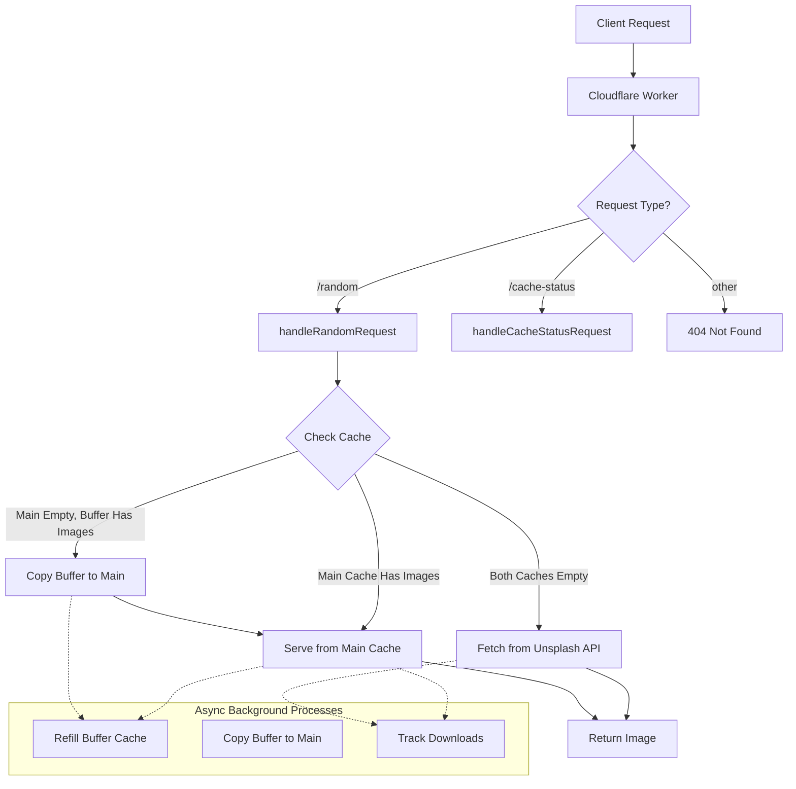
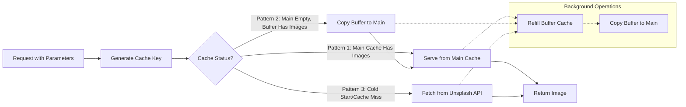

# Unsplash Workers API

## Description
The Unsplash Workers API is a serverless application built with Cloudflare Workers that provides a high-performance, cached interface to Unsplash images. It features an advanced dual-cache system that minimizes API calls to Unsplash while delivering fast responses.

## Features
- Fast random image delivery with intelligent caching
- Parameter-specific cache system for different use cases
- Support for collections, orientations, and Photo of the Day
- Dynamic image resizing and formatting options
- Built-in download tracking compatible with Unsplash attribution
- Circuit breaker pattern to handle API failures gracefully
- Detailed cache monitoring

## Architecture



## Caching System
The API employs a sophisticated dual-cache system that minimizes API calls to Unsplash:

1. **Parameter-Specific Caching**: Each unique combination of parameters (orientation, collections, etc.) gets its own dedicated cache
2. **Main Cache**: Serves immediate requests
3. **Buffer Cache**: Preloads images to refill the main cache
4. **Background Refill**: Automatically refills caches without affecting response times



## Setup

### Prerequisites
- Cloudflare account
- Unsplash API access key

### Environment Variables
You need to set up the following environment variable in your Cloudflare Workers configuration:
- `ACCESS_KEY`: Your Unsplash API key

### KV Storage
Create a KV namespace called `NAZKVHUBSTORE` in your Cloudflare dashboard and bind it to your worker.

## API Reference

### Endpoints

#### GET /random
Fetch a random image from Unsplash with optional filtering and formatting.

**Query Parameters:**
| Parameter | Type | Description |
|-----------|------|-------------|
| `orientation` | string | Filter by image orientation: `landscape`, `portrait`, or `squarish`. Default: `landscape` |
| `collections` | string | Comma-separated list of Unsplash collection IDs |
| `addPhotoOfTheDay` | boolean | When `true`, pulls from Unsplash's Photo of the Day collection |
| `dl` | boolean | When `true`, tracks download with Unsplash and returns direct image URL |
| `url` | string | Image size to return: `full`, `regular`, `small`, `thumb`, `raw` |
| `w` | number | Width for dynamic resizing |
| `h` | number | Height for dynamic resizing |
| `nocache` | boolean | When `true`, bypasses the cache and fetches directly from Unsplash |
| `crop` | string | Crop parameter for the image |
| `fm` | string | Format of the image (e.g., `jpg`, `png`) |
| `q` | number | Quality of the image (1-100) |
| `fit` | string | Fit parameter for the image |
| `dpr` | number | Device pixel ratio |

**Response Format:**
```json
{
  "imageUrl": "https://images.unsplash.com/photo-1234...",
  "artistName": "Photographer Name",
  "artistProfileUrl": "https://unsplash.com/@username",
  "photoId": "photo123",
  "description": "Image description"
}
```

#### GET /cache-status
View the current status of all parameter-specific caches in the system.

**Response Format:**
```json
{
  "default": {
    "mainCache": {
      "images": 12,
      "fillPercent": 40,
      "currentPointer": 5
    },
    "bufferCache": {
      "images": 30,
      "fillPercent": 100,
      "currentPointer": 0
    },
    "isRefilling": false,
    "lastRefillTime": 1626547823000,
    "lastRefreshRelative": "5 minutes ago"
  },
  "orientation=portrait": {
    // similar structure for other cache keys
  }
}
```

## Example Usage

### Basic Random Image
```
https://your-worker.example.workers.dev/random
```

### Landscape Image from a Specific Collection
```
https://your-worker.example.workers.dev/random?orientation=landscape&collections=1538150
```

### Portrait Image with Custom Size
```
https://your-worker.example.workers.dev/random?orientation=portrait&w=800&h=1200&dl=true
```

### Photo of the Day with Direct Download Link
```
https://your-worker.example.workers.dev/random?addPhotoOfTheDay=true&dl=true
```

## Deploying the Worker

To deploy the Unsplash Workers API, click the button below:

[](https://deploy.workers.cloudflare.com/?url=https://github.com/nazdridoy/unsplash-workers-api)

## Performance Considerations
- First requests to a specific parameter combination may be slower due to cold starts
- Subsequent requests will be much faster due to the caching system
- Setting `nocache=true` will always be slower as it bypasses the cache

## License

This project is licensed under the MIT License - see the [LICENSE](LICENSE) file for details.

## Acknowledgments

- [Unsplash](https://unsplash.com) for providing beautiful images
- [Cloudflare Workers](https://workers.cloudflare.com) for enabling serverless functions
