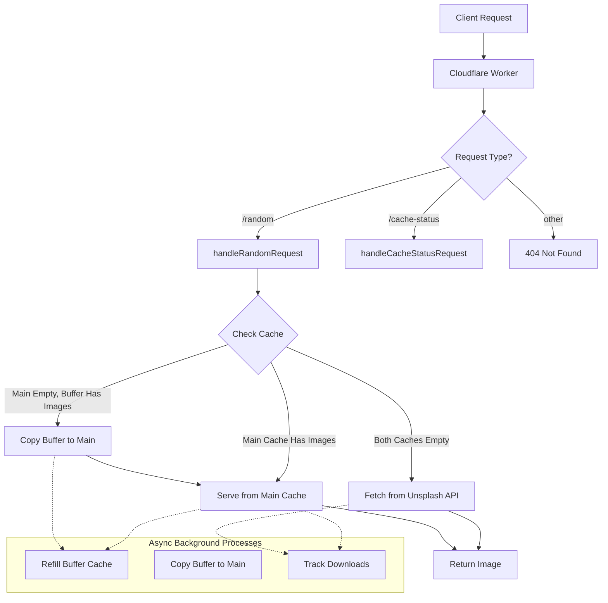
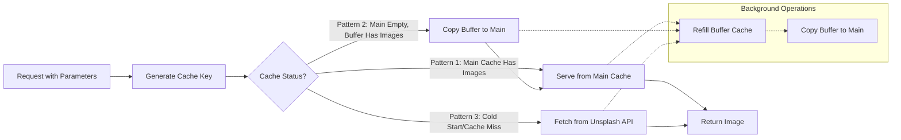

# Unsplash Workers API

## Description
The Unsplash Workers API is a serverless API built with Cloudflare Workers that allows you to efficiently fetch and serve images from Unsplash.

## Features
- Fetch random images from Unsplash
- Search for images based on keywords
- Lightweight and fast response times
- Built with Cloudflare Workers for serverless deployment

## Architecture

## Caching System

## Deploying the Worker

To deploy the Unsplash Workers API, click the button below:

### API Endpoints

- **GET /random**: Fetch a random image from Unsplash.
  - **Query Parameters:**
    - `collections`: (optional) Comma-separated list of collection IDs to filter the images.
    - `orientation`: (optional) The orientation of the image. Default is `landscape`.
    - `dl`: (optional) Set to `true` to track downloads.
    - `addPhotoOfTheDay`: (optional) Set to `true` to include the photo of the day.
    - `url`: (optional) Specify the image type to return (e.g., `full`, `regular`, `small`, `thumb`, `raw`).
    - `w`: (optional) Width for dynamic resizing.
    - `h`: (optional) Height for dynamic resizing.
    - `crop`: (optional) Crop parameter for the image.
    - `fm`: (optional) Format of the image.
    - `q`: (optional) Quality of the image.
    - `fit`: (optional) Fit parameter for the image.
    - `dpr`: (optional) Device pixel ratio.

- **GET /cache-status**: View the current status of the caching system.

## License

This project is licensed under the MIT License - see the [LICENSE](LICENSE) file for details.

## Acknowledgments

- [Unsplash](https://unsplash.com) for providing beautiful images.
- [Cloudflare Workers](https://workers.cloudflare.com) for enabling serverless functions.
